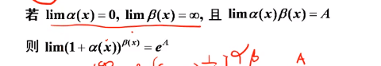

---
puppeteer:
  landscape: true
  format: "A4"
  timeout: 3000 # <= Special config, which means waitFor 3000 ms

export_on_save:
puppeteer: true # export PDF on save
puppeteer: ["pdf", "png"] # export PDF and PNG files on save
puppeteer: ["png"] # export PNG file on save
---

# 第二章 极限

## 2.1 极限定义

### 2.1.1 数列极限定义

$\lim\limits_{x \to \infty} x_n$ = a  
$\forall\epsilon>0$, $\exists N$, 当 $n>N$ 时，$|x_n-a|<\epsilon$

几何意义：  
$\epsilon$表示接近程度, $n>N$表示到$\infin$的过程  
表示当 $n>N$ 时，$x_n$所有的点都在 $a-\epsilon$ 和 $a+\epsilon$ 之间

### 2.1.2 函数极限定义

$\lim\limits_{x \to a} f(x) = A$
$\forall\epsilon>0$, $\exists \delta>0$, 当 $0<|x-a|<\delta$ 时，$|f(x)-A|<\epsilon$

## 2.2 极限的性质

1. 有界性(局部有界性)
   > 如果$\lim\limits_{x \to \infty} f(x) = A$, 那么存在常数 M>0 和$\delta>0$，使得当 $0<|x-a|<\delta$ 时，$|f(x)|<M$
2. 保号性
   > 极限大于(小于)0,则极限的去心领域内，函数值大于(小于)0
   > 去心领域函数值$\geq$($\leq$)0,则极限$\geq$($\leq$)0

## 2.3 极限存在准则

1. 夹逼准则（多用与数列求和）
2. 单调有界（单调增加有上界，单调减少有下界）

## 2.4 无穷小

## 2.5 无穷大

## 2.6 求极限的方法

### 基本极限定理

1. 常用基本极限
   
2. $1^\infty$: $\lim[1 + \alpha(x)]^\beta(x)$形式
   

### 等价无穷小

1. 代换规则

   - 乘除无条件代换
   - $\color{red}{加减有条件代换}$(进阶规则)

2. 常见等价无穷小
   

### 有理运算法则

若$\lim f(x) = A$, $\lim g(x) = B$, 那么:

$\lim(f(x) \pm g(x)) = \lim f(x) \pm \lim g(x)$  
$\lim(f(x) \cdot g(x)) = \lim f(x) \cdot \lim g(x)$  
$\lim (\frac{f(x)}{g(x)}) = \frac{\lim f(x)}{\lim g(x)}$ $(B \neq 0)$

$\color{red}{注意: }$对极限进行有理化拆分时，注意每一项必须**有极限**。

$\color{green}{推广: }$

1. 只有存在 $\pm$ 不存在 = 不存在，其余都是不一定。
2. 因式中可以将有具体值的项提出来，如$\lim \frac{2x^2 + 3x + 1}{x^2 + 2x + 1} = \lim \frac{x^2(2 + \frac{3}{x} + \frac{1}{x^2})}{x^2(1 + \frac{2}{x} + \frac{1}{x^2})} = \lim \frac{2 + \frac{3}{x} + \frac{1}{x^2}}{1 + \frac{2}{x} + \frac{1}{x^2}} = \frac{2}{1} = 2$

### 拉格朗日中值定理

$\frac{f(b)- f(a)}{b - a} = f'(\delta)$, 其中$\delta \in (a, b)$
衍生至在求极限过程中，将两$\color{blue}{同一函数形式}$相减，转化为两数相乘的形式，再用拉格朗日中值或者等价定理求解。
$f(b) - f(a) = f'(\delta)(b - a)$
$\color{red}{注意: }$拉格朗日中值定理只能用于求函数极限，不能用于数列极限。

### 洛必达

$\lim \frac{f(x)}{g(x)} = \lim \frac{f'(x)}{g'(x)}$

条件：

1. $\lim f(x) = \lim g(x) = 0$ 或 $\lim f(x) = \lim g(x) = \infin$
2. $\lim f'(x)$, $\lim g'(x)$存在（$\color{red}{在判断题中尤其注意，f(x) 和 g(x)的导数必须存在不代表导数的极限存在}$）
3. $\lim g'(x) \neq 0$

### 泰勒公式

f(x)在 x=a 处的 n 阶泰勒公式为：

$f(x) = f(a) + f'(a)(x-a) + \frac{f''(a)}{2!}(x-a)^2 + ... + \frac{f^{(n)}(a)}{n!}(x-a)^n + R_n(x)$

常见泰勒公式：

1. $e^x = 1 + x + \frac{x^2}{2!} + \frac{x^3}{3!} + ... + \frac{x^n}{n!} + R_n(x)$
2. $sinx = x - \frac{x^3}{3!} + \frac{x^5}{5!} + ... + (-1)^n\frac{x^{2n+1}}{(2n+1)!} + R_n(x)$
3. $cosx = 1 - \frac{x^2}{2!} + \frac{x^4}{4!} + ... + (-1)^n\frac{x^{2n}}{(2n)!} + R_n(x)$
4. $ln(1+x) = x - \frac{x^2}{2} + \frac{x^3}{3} + ... + (-1)^{n-1}\frac{x^n}{n} + R_n(x)$
5. $\frac{1}{1-x} = 1 + x + x^2 + ... + x^n + R_n(x)$
6. $(1+x)^m = 1 + mx + \frac{m(m-1)}{2!}x^2 + ... + \frac{m(m-1)...(m-n+1)}{n!}x^n + R_n(x)$
7. $tanx = x + \frac{x^3}{3} + \frac{2x^5}{15} + ... + \frac{2^{n-1}x^{2n-1}(2^{n-1}-1)}{n} + R_n(x)$
8. $\arctan x = x - \frac{x^3}{3} + \frac{x^5}{5} + ... + (-1)^{n-1}\frac{x^{2n-1}}{2n-1} + R_n(x)$
9. $\arcsin x = x + \frac{x^3}{6} + \frac{3x^5}{40} + ... + \frac{(2n-1)!!}{(2n)!!}x^{2n+1} + R_n(x)$

$\color{#4da6ff}{提示}$：
泰勒公式常用于将低阶无穷小转化为高阶无穷小，从而求极限。

### 夹逼准则

$f(x) \leq g(x) \leq h(x)$, $\lim f(x) = \lim h(x) = A$, 则 $\lim g(x) = A$

常用于数列求和中, 例如： $\lim \frac{1}{n+1} + \lim \frac{2}{n+2} + \dotsb + \lim \frac{n}{n + n}$

### 单调有界

单调有界常用于推导式子的极限，例如：$a_{n+1} = f(a_n)$

分为三部曲：

1. 有界
2. 单调
3. $\lim a_{n+1} = A \iff \lim a_n = A$, 所以 $A = f(A)$, 求出 A 的值

### 定积分定义

定积分定义求极限方法一般用于数列求和中

$\lim \sum_{i=1}^n f(\xi_i) \Delta x_i = \int_a^b f(x)dx$
$\lim \sum_{i=1}^n f(\xi_i) \Delta x_i = \frac{1}{n} \lim \sum_{i=1}^n f(\frac{\xi_i}{n}) = \int_0^1 f(\frac{\xi_i}{n})dx$

**着重在于提取$\frac{1}{n}$，看其余项是否满足一个可积分函数**

## 函数的连续性

### 概念

1. 若 $\lim\limits_{\Delta x \to 0} f(x_0+\Delta x) - f(x_0) = 0$, 则称 f(x) 在 $x_0$ 处连续
2. 若 $\lim\limits_{x \to x_0} f(x) = f(x_0)$, 则称 f(x) 在 $x_0$ 处连续
3. 若 $\lim\limits_{x \to x_0^+} f(x) = f(x_0)$, 则称 f(x) 在 $x_0$ 处**右连续**
4. 若 $\lim\limits_{x \to x_0^-} f(x) = f(x_0)$, 则称 f(x) 在 $x_0$ 处**左连续**

### 定理

$f(x)$连续$\iff$ $f(x)$左连续且右连续

### 间断点及其分类

#### 间断点的定义

若 $f(x)$ 在 $x_0$ 某去心领域有定义，但在 $x_0$ 处不连续，则称 $x_0$ 为 $f(x)$ 的间断点

#### 间断点的分类

1. 第一类间断点：左右极限都存在

   - 可去间断点： 左极限 $=$ 右极限： 例如： $\lim\limits_{x \to 0} \frac{sinx}{x} = 1$
   - 跳跃间断点： 左极限 $\neq$ 右极限

2. 第二类间断点：左右极限至少有一个不存在

   - 无穷间断点： 例如：$\lim\limits_{x \to 0^+} \frac{1}{x} = \infin$
   - 振荡间断点： 例如：$\lim\limits_{x \to 0} sin\frac{1}{x}$

#### 连续性的运算与性质

1. 连续函数的四则运算仍然连续
2. 连续函数的复合仍然连续
3. 基本初等函数在其**定义域**内连续
4. 初等函数在其**定义区间**内连续
5. 若 f(x)在[a,b]上连续，则 f(x)在[a,b]上有界($\color{red}{有界性定理}$)
6. 若 f(x)在[a,b]上连续，则 f(x)在[a,b]上有最大值和最小值($\color{red}{最值定理}$)
7. 若 f(x)在[a,b]上连续，且 $f(a) \neq f(b)$，则 f(x)在[a,b]上至少有一个介于 f(a) 和 f(b) 之间的值($\color{red}{介值定理}$)
8. 若 f(x)在[a,b]上连续，且 f(a) $\cdot$ f(b) < 0, 则在(a,b)内至少有一个根($\color{red}{零点定理}$)

## 常见题型

### 无穷小比较

解题思路：

1. 诺必塔法则
2. 等价无穷小
3. 泰勒公式
